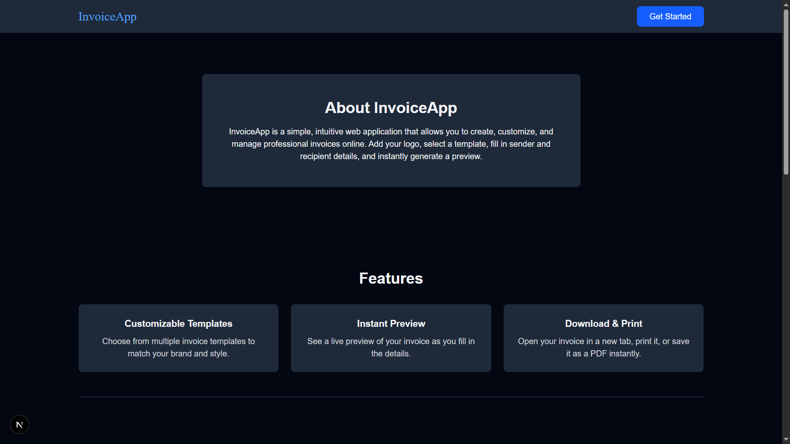
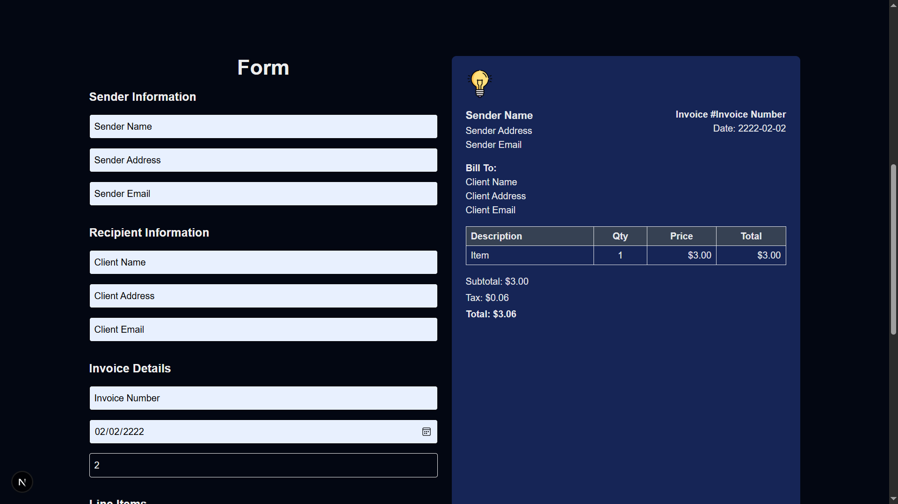
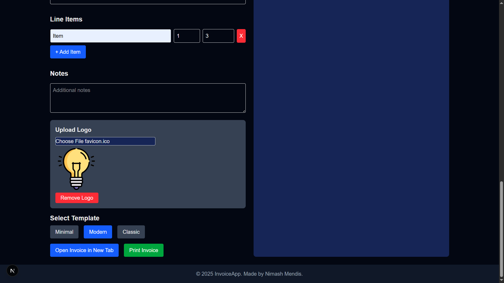

# LogoUploader Component

A simple and reusable **React + TypeScript + Tailwind CSS** component for uploading, previewing, and removing a logo image.  
Built with Next.js client-side rendering (`"use client"`).

## ✨ Features
- 📤 **Image Upload** – Supports PNG, JPG, SVG, and other image formats.
- 👀 **Instant Preview** – See the uploaded image right away.
- ❌ **Remove Logo** – Clear the selected logo with one click.
- 🎨 **Tailwind CSS Styling** – Fully customizable styles.
- ⚡ **Lightweight & Reusable** – Easy to integrate into any project.
- 🔄 **TypeScript Support** – Strongly typed for better developer experience.

## Images





## 📦 Installation
Make sure you have **Next.js**, **TypeScript**, and **Tailwind CSS** set up in your project.

## Getting Started

1. Clone the repo:

```bash
git clone https://github.com/n1cKar/invoice-app.git
cd invoice-app
```

2. Install dependencies:

```bash
npm install
# or
yarn install
```
3. Run the development server:

```bash
npm run dev
# or
yarn dev
```
4. Open http://localhost:3000 in your browser to vist.


## Contact

Created by [Nimash Mendis](https://github.com/n1cKar).  
Feel free to reach out for questions, feedback, or collaboration!
email: nimash.mendis0202@gmail.com
